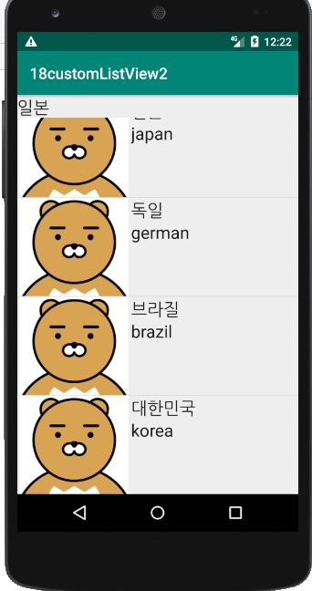
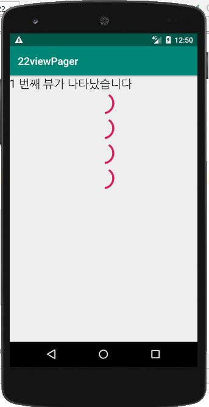

## -목차-
&nbsp;&nbsp;16.  [리스트뷰 이미지](https://github.com/diqksrk/android-kotlin-practice#16-리스트뷰) 
&nbsp;&nbsp;17.  [custom리스트뷰 이미지](https://github.com/diqksrk/android-kotlin-practice#17-custom리스트뷰) 
&nbsp;&nbsp;18.  [custom리스트뷰2 이미지](https://github.com/diqksrk/android-kotlin-practice#18-custom리스트뷰2) 
&nbsp;&nbsp;19.  [twoLine리스트뷰 이미지](https://github.com/diqksrk/android-kotlin-practice#19-twoLine리스트뷰) 
&nbsp;&nbsp;20.  [CustomAdapter 이미지](https://github.com/diqksrk/android-kotlin-practice#20-CustomAdapter) 
&nbsp;&nbsp;21.  [Spinner 이미지](https://github.com/diqksrk/android-kotlin-practice#21-Spinner) 
&nbsp;&nbsp;22.  [ViewPager 이미지](https://github.com/diqksrk/android-kotlin-practice#22-ViewPager) 
&nbsp;&nbsp;23.  [OptionMenu 이미지](https://github.com/diqksrk/android-kotlin-practice#23-OptionMenu) 
&nbsp;&nbsp;24.  [ContextMenu 이미지](https://github.com/diqksrk/android-kotlin-practice#24-ContextMenu) 
 
## 1. 이미지.

#### 16) 리스트뷰()

#### 17) custom리스트뷰()

#### 18) custom리스트뷰2()

#### 19) twoLine리스트뷰()

#### 20) CustomAdapter()

#### 21) Spinner()

  
  

#### 22) ViewPager()

  

#### 23) OptionMenu()

  

#### 24) ContextMenu()

  

