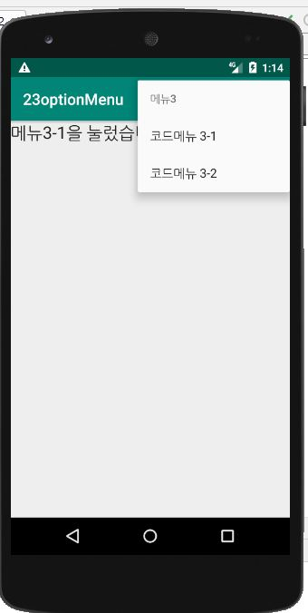

## -목차-
&nbsp;&nbsp;16.  [리스트뷰 이미지](https://github.com/diqksrk/android-kotlin-practice#16-리스트뷰) 
&nbsp;&nbsp;17.  [custom리스트뷰 이미지](https://github.com/diqksrk/android-kotlin-practice#17-custom리스트뷰) 
&nbsp;&nbsp;18.  [custom리스트뷰2 이미지](https://github.com/diqksrk/android-kotlin-practice#18-custom리스트뷰2) 
&nbsp;&nbsp;19.  [twoLine리스트뷰 이미지](https://github.com/diqksrk/android-kotlin-practice#19-twoLine리스트뷰) 
&nbsp;&nbsp;20.  [CustomAdapter 이미지](https://github.com/diqksrk/android-kotlin-practice#20-CustomAdapter) 
&nbsp;&nbsp;21.  [Spinner 이미지](https://github.com/diqksrk/android-kotlin-practice#21-Spinner) 
&nbsp;&nbsp;22.  [ViewPager 이미지](https://github.com/diqksrk/android-kotlin-practice#22-ViewPager) 
&nbsp;&nbsp;23.  [OptionMenu 이미지](https://github.com/diqksrk/android-kotlin-practice#23-OptionMenu) 
&nbsp;&nbsp;24.  [ContextMenu 이미지](https://github.com/diqksrk/android-kotlin-practice#24-ContextMenu) - 뷰를 길게 클릭했을 경우 리스트가 나오게 하는 경우 
 
## 1. 이미지.

#### 16) 리스트뷰()

#### 17) custom리스트뷰()

#### 18) custom리스트뷰2()

#### 19) twoLine리스트뷰()

#### 20) CustomAdapter()

#### 21) Spinner()

  
  

#### 22) ViewPager()

  

#### 23) OptionMenu()

  

#### 24) ContextMenu()

  

첫번째 화면의 경우 해당 리스트뷰가 나오는 경우

두번째 화면의 경우 해당 리스트를 길게 누를경우 따로 리스트가 떠서 누르면 화면에 어떤 리스트를 눌렀는지 알려주는 경우( ex) 예를 들면 리스트1의 리스트뷰메뉴 1을 누를경우 0번째 항목을 누른걸 알려준다. 주로 삭제 버튼을 누를 경우 인덱스를 통한 항목 삭제에 이용한다.)

